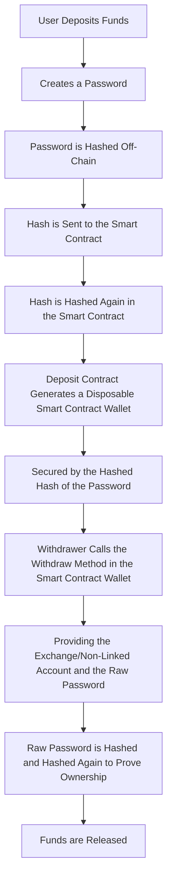

# Stealthy - Stealth Crypto Payment Platform

Stealthy is a stealth crypto payment platform built with Angular and Solidity. It allows users to send payments of TRC10 tokens psuedo-anonymously while providing a layer of privacy. The smart contracts have been deployed to Tron test networks with the following contract address:

**Address: TF7n3VPwofUergujURnouxtubN1GKtndLv**

## How it Works

## Notice
Please note that the project is not audited and should only be used in testnet.

## License
This project is licensed under the MIT License.
